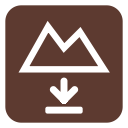

# Geodata: Markhöjd direkt (Lantmäteriet)

> **Disclaimer:** This plugin is independent and has no connection to, and is not approved or
> provided by, Lantmäteriet (the Swedish mapping, cadastral and land registration authority). The name
> *Lantmäteriet* is used only to identify the source of the elevation data. The plugin is provided as is,
> without warranty.

Fetches ground elevation from the Lantmäteriet service [Markhöjd Direkt](https://www.lantmateriet.se/sv/geodata/vara-produkter/produktlista/markhojd-direkt/)
(the national ground elevation model, 1 m grid, height system RH 2000, covering Sweden).

**The user interface is in Swedish.** The section [User interface](#user-interface) below explains every control in English.
A detailed user guide, in Swedish, is in [docs/anvandarhandledning.md](docs/anvandarhandledning.md).

## Features

1. **Height at a point**: activate *Klicka i kartan för höjd* and click. The point is marked with a cross and the
   height is shown in meters (1 decimal by default). Font, text size and number of decimals can be set in the panel.
2. **Height grid in an area**: draw a polygon (or use selected polygons in a layer), choose the point spacing and
   click *Hämta höjder*. The plugin lays a regular grid in the area and fetches the height at each grid point.
3. **Heights along a line**: draw a line, or use an existing line feature, and set the point spacing. The points are
   fetched in order from the start to the end of the line and get an attribute `avstand` (distance in meters from the start),
   suitable for an elevation profile. A MultiLineString is merged automatically and its direction unified. The button
   *Visa profil* can show distance/height as a graph in a separate QGIS panel.
4. **3D points**: all results are PointZ layers in SWEREF 99 TM (EPSG:3006) with the height as Z value and as the
   attribute `hojd`. Save as GeoPackage, Shapefile or CSV (X,Y,Z).

## Requirements and connection

The service is only open to system accounts that have ordered Markhöjd Direkt from Lantmäteriet. Requests use HTTP Basic
authentication (username and password of the system account), the same way as in HAJK. The credentials are stored in the
QGIS authentication database:

* Choose the environment (production / verification).
* Click *Ny nyckel…* and enter username and password, or select an existing Basic configuration.
* *Testa* calls `/health` and fetches the height at a test point.

The plugin has no dependencies beyond QGIS itself (3.34 or later, also QGIS 4) and works on Windows, Linux and macOS.

## Service limits

According to the technical description v1.0.1 and product description v1.6:

| Limit | Value |
|---|---|
| Points in a MultiPoint per request | 1,000 |
| Vertices in LineString/Polygon per request | 1,000 |
| Area per request (according to the error message in the documentation) | 1,000,000 m² |
| Number of requests per time unit | **Not documented**, controlled by the subscription plan in the API portal |

The plugin therefore splits a grid into requests of at most 1,000 points within a square of at most 900 × 900 m, fetches them
one after another with a short pause, and retries with a delay on HTTP 429/503 (respecting `Retry-After`).
If your agreement has a lower quota, lower *Max antal punkter*.

## How dense should the grid be?

The source is a 1 m grid, so a spacing below 1 m gives no new information. You can control either the
**point spacing** (m) or the **maximum number of points**. The button *Anpassa punktavstånd* calculates the
spacing that gives about 100 points. The panel always shows the estimated number of points and requests.
Rule of thumb: 1 ha gives 100 points at 10 m and 10,000 points at 1 m. The default is 10 m and at most 20,000 points.

## User interface

The user interface is in Swedish. This section explains it in English. All controls are in one dock panel,
*Geodata: Markhöjd direkt (Lantmäteriet)*, opened from the toolbar icon or the *Plugins* menu.

### Group "Anslutning" (Connection)
Selects the environment and the stored credentials used for all requests.

| Swedish label | English meaning | What it does |
|---|---|---|
| Miljö | Environment | Chooses the service environment: *Produktion* (production) or *Verifiering* (verification/test) |
| Autentisering | Authentication | Selects the stored QGIS authentication configuration (username/password) |
| Ny nyckel… | New key… | Opens a dialog to store a new username/password in the QGIS authentication database |
| Testa | Test | Checks that the service is up and fetches the height at a test point |

The dialog "Ny anslutning till Lantmäteriet" (New connection to Lantmäteriet) has the fields *Användarnamn* (Username) and *Lösenord* (Password).

### Group "Höjd i en punkt" (Height at a point)
| Swedish label | English meaning | What it does |
|---|---|---|
| Klicka i kartan för höjd | Click in the map for height | Toggles a map tool; each click fetches the height and adds a cross with the height value to the layer *Markhöjd – punkter* |
| Typsnitt | Font | Font of the height label |
| Textstorlek | Text size | Size of the height label in points |
| Decimaler | Decimals | Number of decimals shown in the label (0-3) |

### Group "Höjdgrid i ett område" (Height grid in an area)
| Swedish label | English meaning | What it does |
|---|---|---|
| Rita område | Draw area | Map tool: left click adds a vertex, right click/Enter finishes, Esc restarts |
| Markerad polygon | Selected polygon | Uses the selected polygons of the active layer as the area |
| Rensa | Clear | Removes the chosen area |
| Punktavstånd | Point spacing | Distance in meters between grid points |
| Max antal punkter | Max number of points | Safeguard against fetching too much by mistake |
| Anpassa punktavstånd (ca 100 punkter) | Adjust point spacing (about 100 points) | Sets a spacing that gives about 100 points in the area |
| Hämta höjder | Fetch heights | Fetches the heights and creates a new point layer, e.g. *Markhöjd – grid 10 m* |
| Avbryt | Cancel | Stops a running fetch; points already fetched are kept |

### Group "Höjder längs en linje" (Heights along a line)
| Swedish label | English meaning | What it does |
|---|---|---|
| Rita linje | Draw line | Map tool: left click adds a point, right click/Enter finishes, Esc restarts |
| Markerad linje | Selected line | Uses the single selected line feature of the active layer |
| Rensa | Clear | Removes the chosen line |
| Punktavstånd | Point spacing | Distance in meters between points along the line |
| Hämta höjder längs linjen | Fetch heights along the line | Creates a layer such as *Markhöjd – linje 10 m* with the attribute `avstand` |
| Visa profil | Show profile | Shows distance/height as a graph in a separate panel (enabled after a fetch) |

### Group "Spara som 3D-punkter" (Save as 3D points)
| Swedish label | English meaning | What it does |
|---|---|---|
| (layer list) | Layer to save | Chooses which point layer to save |
| Spara lager… | Save layer… | Saves as GeoPackage, Shapefile or CSV with X,Y,Z |

### Messages
| Swedish message | English meaning | When it appears |
|---|---|---|
| Inget område valt. / Ingen linje vald. | No area / no line selected. | Nothing has been drawn or selected yet |
| Välj eller skapa en autentiseringskonfiguration först. | Choose or create an authentication configuration first. | Fetching without stored credentials |
| Åtkomst nekad (401/403) | Access denied | Wrong credentials, or the account has not ordered the service in this environment |
| Ingen höjddata för den punkten. | No height data for that point. | The clicked point is outside the model coverage |
| N höjdpunkter hämtade | N height points fetched | A fetch has finished |
| Fler än max … punkter; öka punktavståndet. | More than the maximum number of points; increase the spacing. | The grid or line would exceed *Max antal punkter* |

## Installation

Install from the QGIS Plugin Manager (search for *Markhöjd*), or download `markhojd_direkt.zip` from
[Releases](https://github.com/matself/markhojd-direkt-qgis-plugin/releases) and choose
*Plugins → Manage and Install Plugins → Install from ZIP*.

## Development

Tests for the pure logic run with `pytest tests/test_core.py`. The grid test `tests/test_grid.py` requires the Python that ships
with QGIS (`python-qgis.bat`). `python package.py` builds `dist/markhojd_direkt.zip` and updates `plugins.xml`.

License: GPL-3.0 (see `LICENSE`).
